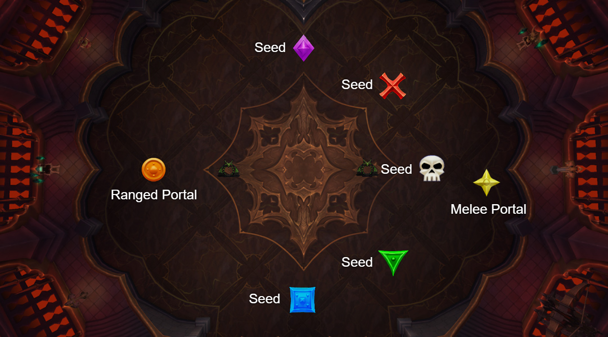
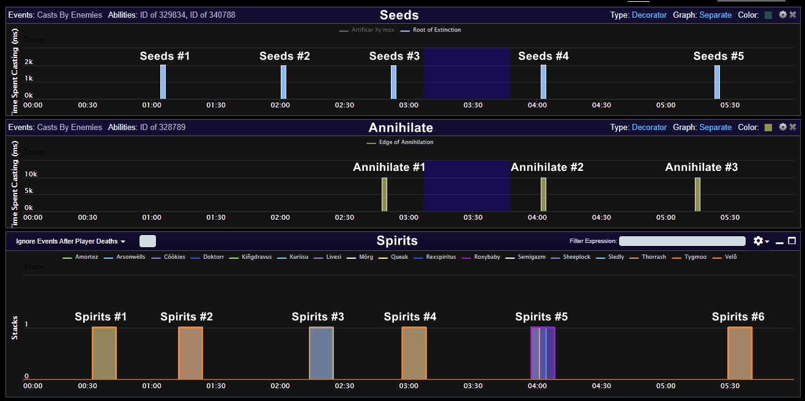
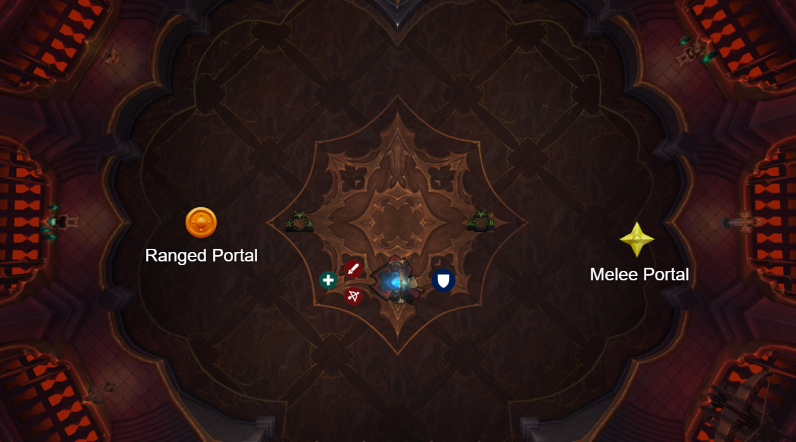
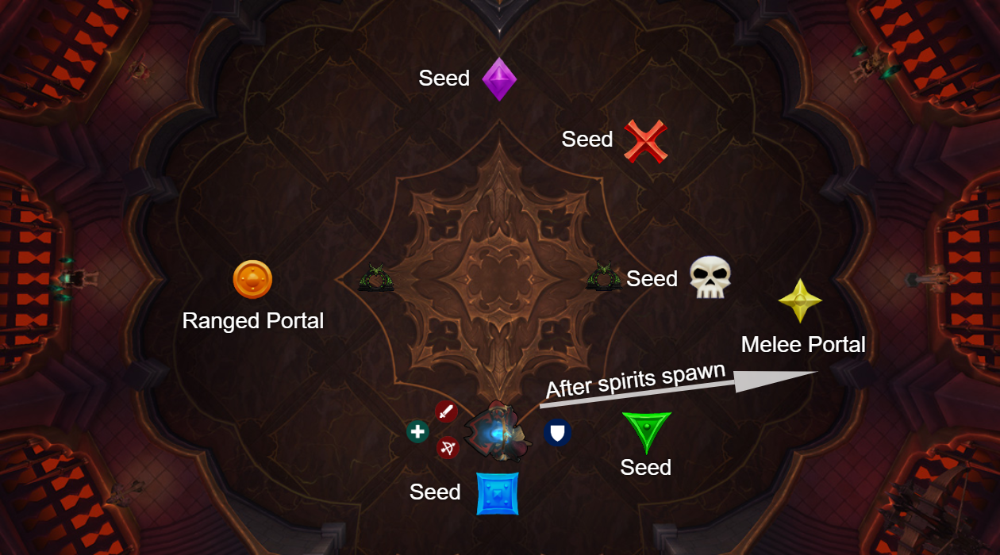
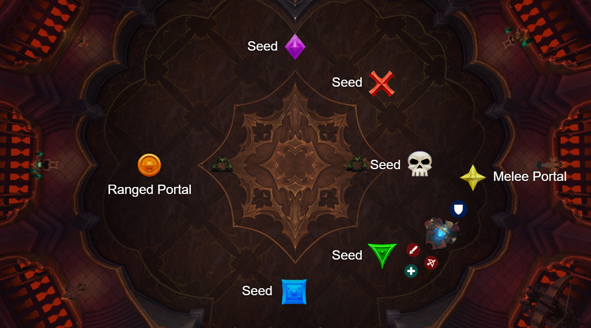

Mythic Artificer Xy'mox Overview
===================================

**A lot of the info on this page is based on the video guide by Limit Max. I'd recommend watching if you have the time.**   

**Links:** 
- **[Raid guide: Mythic Artificer Xy'mox \[34:37\]](https://www.youtube.com/watch?v=Q5VyK2Q5B5U)**
  - This is a general strategic overview. Topics covered include: CD usage and timing, dealing with mechanics & difficult overlaps, and boss positioning.
- **[Wowhead Guide](https://www.wowhead.com/guides/artificer-xymox-castle-nathria-raid-strategy-guide)**
  - This is not comprehensive but does have basic information on the majority of the fight mechanics.
- **[Raidplan.io Map](https://raidplan.io/plan/ucYWGNVgrQT8MMtp)**
  - Map of positioning for the fight. Made by Lissandine.
  
**Because of how early the third phase occurs, this guide will be organized according to when mechanics are happening and their overlaps.**
  
Table of Contents
=================
Mechanics overlaps marked with ⚠️ should be paid special attention. Each has a specific way of dealing with them to allow them to be done cleanly.

- [Introduction - What's new](#introduction)
  - [Phasing](#phasing)
  - [Fleeting Spirits](#fleeting-spirits)
  - [Portal Placement](#portal-placement)
  - [Offensive CDs](#offensive-cds)
- [Walkthrough](#walkthrough)
  - Spirits #1
  - ⚠️ Seeds #1 + Spirits #2
  - Seeds #2 + Spirits #3
  - ⚠️ Seeds #3 + Spirits #4 + Annihilation #1
  - ⚠️ Seeds #4 + Spirits #5 + Annihilation #2
  - Seeds #5 + Spirits #6 + Annihilation #3

Introduction - What's new
=========================

## Phasing
The major difference in this fight is that in mythic, each major mechanic (spirits, seeds, suck) adds on to the previous ones. Additionally, the phasing now happens at **80%** and **60%**, rather than at 70% and 40% as in heroic. 

**TL;DR**, in mythic the phases look like this:

- Phase 1 (100% - 80%): Spirits
- Phase 2 (80% - 60%): Spirits *and* seeds
- Phase 3 (60% - 0%): Spirits *and* seeds *and* big suck

Sometimes the mechanics will overlap in ways that are very icky. It is important to position well and know how to deal with the mechanics -- especially difficult overlaps.

## Fleeting Spirits
In mythic, if a player is hit by a spirit, they are now mind-controlled *until they are killed*. Therefore, it is especially important to kite spirits properly.

**Important Mechanical Note: Spirits spawn behind the player**. This means it is important to be facing the direction in which the spirits will be kited. The boss *should* be positioned in such a way that everyone can be facing the correct direction when spirits come out without sacrificing damage.

**TL;DR: Do not face your back toward the portal.**

## Portal Placement
Portals will be positioned on opposite sides of the room *for the entire fight*. This is because spirits need to be kited and seeds need to be moved for the entire fight. During the big suck, instead of relying on a portal in the center of the room, raid movement CDs such as Wind Rush Totem and Stampeding Roar will be used.

## Offensive CDs
Lust will occur around 3 minutes into the fight, after the first Annihilation mechanics set.

During progression, the optimal timings for offensive cooldowns are as follows:
  - 2 minute CDs will be used on pull and then **held for lust**.
  - 3 minute CDs will be used on pull and then held for lust.
  - Longer cooldowns should *not* be used on pull and should instead be held for lust (DH's meta, Unholy's army, etc.)

Mechanics & Positioning
===========

Throughout the fight you will have to deal with 3 mechanics: Fleeting Spirits, Seeds of Extinction, and Annihilation. These mechanics will be introduced in phases, but will stick around for the entire fight once they show up. This means there will be some difficult overlaps to deal with, and hopefully the walkthrough below helps a little bit with doing so.

## Fleeting Spirits

Throughout the fight, typically lining up in timing with seeds spawning, Xy'mox will cast [\[Fleeting Spirits\]](https://www.wowhead.com/spell=340758/fleeting-spirits), spawning a spirit **behind the player** (that is, in the opposite direction from where the player is facing) which will chase the player and attempt to mind-control them. If a player is mind-controlled, they will need to be killed by their teammates.

Players will use the portals on **Star** and **Circle** to kite their spirits.

## Seeds of Extinction

Approximately once per minute starting in phase 2 (80% hp and onward), [\[Seeds of Extinction\]] will be cast, spawning Seeds at the marked locations seen in the image above (**Diamond**, **X**, **Skull**, **Triangle**, and **Square**) which will need to be moced to the **Circle** side of the room, opposite where the boss is located. 

Players will be assigned to various markers to move seeds for the entire fight (an exception being Seeds #4 which requires some extra care and may be assigned differently).

The first two sets of seeds are fairly straightforward, but players will need to be aware of the spirits which are spawning at the same time and be careful when kiting them. Seeds #3 and #4 occur at the same time as annihilation so their movement will need to be done in a more deliberate manner.

## Edge of Annihilation

Approximately once per minute in phase 3 (60% hp and onward), [\[Edge of Annihilation\]](https://www.wowhead.com/spell=328880/edge-of-annihilation) will be cast, causing players to be sucked toward the center of the room. Players will need to run against this toward the wall. If a player is caught in the annihilation circle when the cast ends they will die. 

Raid movement cooldowns such as Wind Rush Totem and Stampeding Roar will be assigned to each Annihilate in order give players the movement speed required to counteract the suck.

Walkthrough
===========

The above image is taken from [this log](https://www.warcraftlogs.com/reports/14mdH7fwBNQVrPFY#fight=24&type=auras&spells=debuffs&ability=327902&pins=0%24Separate%24%23244F4B%24casts%241%240.0.0.Any%240.0.0.Any%24true%240.0.0.Any%24true%24329834%7C340788%5E0%24Separate%24%23909049%24casts%241%240.0.0.Any%240.0.0.Any%24true%240.0.0.Any%24true%24328789) on warcraftlogs. It depicts the relative timings of the 3 major mechanics players will have to deal with during the fight. This log was chosen because it was a ~6 minute kill which, at the time this was being written, was the average kill time for Artificer Xy'mox.

## Spirits 1

This first set of spirits is the easiest set to deal with, since it occurs with no other mechanics. On pull, the boss will be taken to approximately the location shown above. The boss will be held here to allow ranged players to continue dealing damage as they kite their spirits. Players will position themselves behind the boss so that they can easily kite their spirit into the portal on **Circle**.

## ⚠️ Seeds #1 + Spirits #2

This second set of spirits is the first difficult set of the fight. The boss will be moved toward the entrance of the room, near **Square**. Seeds of extinction will spawn and seed runners will go to move their seeds. As seeds are spawning, spirits will be too. The rest of the raid will want to wait near **Square** to bait the spirits spawn. Once spirits have spawned the raid will move as a group toward the **Star** side wall (see image in the next section for final positioning), and people with spirits will use the portal after Seeds have exploded in order to escape their spirit.

## Seeds #2 + Spirits #3

This set is relatively straightforward to deal with. Seeds will be moved, and once the seeds are about to explode, spirits will start spawning. Spirits can be kited normally. There is no real trick to dealing with this set.

**Important Note** - It is around this set of mechanics where Xymox is reaching 60% hp, the start of phase 3. It is very important to **hold dps** and **do not push** Xymox to 60% until *after* the spirits have spawned. This is because when Xymox phases, he will remove the old set of portals and spawn new ones. If this happens at the wrong time, it will be much more difficult for people to kite their spirits as they will have no portal to run through.
** 

## ⚠️ Seeds #3 + Spirits #4 + Annihilation #1

Running the seeds in this set is deceptively simple. The seeds will spawn a few seconds before the end of the Annihilation cast, leaving plenty of time for seeds to be run *after* the Annihilation ends.

The spirits & seeds overlap is the more difficult part of this set. Spirits will spawn as Annihilation is ending, and players who are fixated by the spirits will want to *immediately* jump into the **Star** portal. Players will wait on the other side until the seeds are about to explode, and then re-enter the portal. This is done to allow the spirits as much time as possible to move away from the boss side of the room while allowing fixated players to live the seed explosion.

Once this set is finished, lust and burn boss. 

## ⚠️ Seeds #4 + Spirits #5 + Annihilation #2

This is the most difficult seed set in the fight. Seeds will spawn toward the start of the annihilation, and most classes will need to use essentially their entire movement toolkit to deal with this set. 

The exception to amove is DKs. A DK (including a tank DK, there is no Glyph of Destruction overlap here) can use [\[Death's Advance\]](https://www.wowhead.com/spell=48265/deaths-advance) to entirely negate the suck mechanic and move the seed without any difficulty. If there are DKs available, while they are not a good choice for running seeds the rest of the fight, it would be beneficial to assign them a seed on this set of seeds in particular because of how well suited they are for dealing with this overlap.

Immunities (Hunter's turtle, mage's Ice Block) are useful on this set for seed runners. Instead of using all available movement to take the seed across the room, a player can move their seed and then immune the Annihilation & Seed explosion on the other side.

There are no more spooky overlaps for the remainder of the fight. Take a deep breath and burn the boss the rest of the way.

## Seeds #5 + Spirits #6 + Annihilation #3

Compared to previous sets, this one is incredibly straightforward. Annihilation will be cast, and only *after* Annihilation finishes will Seeds and Spirits spawn. This makes these mechanics relatively simple to deal with. Thank Blizzard for giving you this easy set after the previous nightmare overlap and continue killing the boss.
